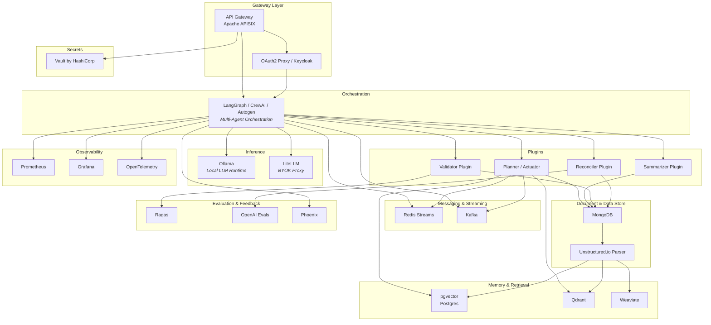

# Oasis

##  Oasis — The AI Operating System for the Enterprise

**Oasis** is a next-generation, plugin-based AI platform designed for reliability, extensibility, and intelligent automation at scale.

As we prepare for our production launch, we’re rapidly integrating the most powerful open-source and free-to-use tools across the AI ecosystem. Oasis is engineered from the ground up to support **highly scalable, reliable, resiliant, modular, available, secure, cloud-agnostic and cloud-native deployments** that empower teams to build, orchestrate, and evolve intelligent systems with full transparency and control.

-------------------

#### What We’re Building

Oasis is a **containerized, enterprise-ready AI platform** with:

* **Plugin-first architecture** for multi-agent workflows
* **BYOK (Bring Your Own Key)** support for models like OpenAI, Claude, Perplexity, and local Ollama instances
* Native support for **agent frameworks** (e.g., LangGraph, Autogen)
* **Built-in RAG (Retrieval-Augmented Generation)** and memory indexing
* **Cross-model validation** and **self-correcting execution** paths
* **Event-driven infrastructure** using Redis Streams or Kafka
* **High-performance API gateway** via Apache APISIX
* **Document and data storage** with MongoDB and PostgreSQL/pgvector
* **Full observability and traceability** for audit and debugging

-------------------

#### Open Source Stack Highlights

**The Oasis stack enables:**

* Secure, multi-tenant BYOK model access
* Composable agent plugins that operate independently or collaboratively
* Self-improving pipelines with validation, challenge, and reconciliation loops
* High-throughput vector search via pgvector or Weaviate/Milvus
* Realtime visibility into LLM reasoning, scoring, and decisions

-------------------

#### Use Cases Enabled

* Automated email and document analysis
* Multi-model validation and decision confidence scoring
* Realtime customer support intelligence
* *Workflow automation with human-in-the-loop governance
* Enterprise-grade LLM observability and auditing

-------------------

Stay tuned as we finalize our infrastructure and roll out the first production-ready components of the Oasis platform. Whether you’re building intelligent agents, secure LLM gateways, or scalable AI services—Oasis will be your foundation.

-------------------

### Key Technologies Pre-Wired

Oasis integrates the most powerful open-source tools across AI, DevOps, observability, and orchestration — pre-wired for plugin-based, cloud-native, and enterprise-scale execution.

| **Capability Area**        | **Technology / Tool**                                                                 | **Role in Oasis**                                                                                   |
|----------------------------|----------------------------------------------------------------------------------------|------------------------------------------------------------------------------------------------------|
| 🧠 Agent Execution          | [LangGraph](https://github.com/langchain-ai/langgraph), [CrewAI](https://github.com/joaomdmoura/crewAI), [Autogen](https://github.com/microsoft/autogen) | Modular multi-agent orchestration with branching flows                                              |
| 🧠 Agent Tracing & Debugging| [LangSmith](https://github.com/langchain-ai/langsmith), [PromptLayer](https://github.com/promptlayer/promptlayer), [Traceloop](https://traceloop.dev/) | Deep inspection of agent runs, prompt auditing, and run visualization                               |
| 📦 LLM Integration          | [Ollama](https://ollama.com/), [LiteLLM](https://github.com/BerriAI/litellm)          | Local inference + BYOK routing for OpenAI, Claude, Perplexity                                       |
| 🔁 RAG Engine               | [LlamaIndex](https://github.com/jerryjliu/llama_index), [Haystack](https://github.com/deepset-ai/haystack) | Retrieval-augmented generation with embedded memory                                                 |
| 🧩 Plugin Management        | JSON/gRPC contracts + Redis/Kafka pub/sub                                             | Hot-swappable plugin execution, plugin discovery and routing                                        |
| 🗃 Vector Storage           | [pgvector](https://github.com/pgvector/pgvector), [Qdrant](https://github.com/qdrant/qdrant), [Weaviate](https://github.com/weaviate/weaviate), [Milvus](https://github.com/milvus-io/milvus) | Semantic similarity search and vector indexing                                                      |
| 📨 Messaging Infrastructure | [Redis Streams](https://redis.io/docs/latest/streams/), [Kafka](https://kafka.apache.org/) | Event-driven plugin chaining, inter-agent communication                                             |
| 📡 API Gateway             | [Apache APISIX](https://github.com/apache/apisix)                                     | API routing, LLM proxying, rate limiting, plugin interface                                           |
| 🔐 Auth & Secrets          | [OAuth2 Proxy](https://github.com/oauth2-proxy/oauth2-proxy), [Vault](https://github.com/hashicorp/vault), [Keycloak](https://github.com/keycloak/keycloak) | Secure API access, SSO, BYOK key management                                                         |
| 📖 Document Ingestion      | [Unstructured.io](https://github.com/Unstructured-IO/unstructured), [Airbyte](https://github.com/airbytehq/airbyte) | Parse and ingest structured/unstructured content from 300+ sources                                  |
| 📈 Evaluation & Feedback   | [OpenAI Evals](https://github.com/openai/evals), [Ragas](https://github.com/explodinggradients/ragas), structured diffs | Score, validate, and retrain based on model and plugin performance                                  |
| 🔬 Observability           | [Prometheus](https://prometheus.io/), [Grafana](https://grafana.com/), [OpenTelemetry](https://opentelemetry.io/), [Phoenix](https://github.com/Arize-ai/phoenix) | Metrics, logging, distributed tracing, model drift & embedding evaluation                           |
| 🧪 Testing & Resilience    | [Chaos Mesh](https://github.com/chaos-mesh/chaos-mesh), [k6](https://github.com/grafana/k6), [Locust](https://github.com/locustio/locust) | Load testing, fault injection, system resilience validation                                          |
| 🧰 Dataflow & ETL          | [Dagster](https://github.com/dagster-io/dagster), [Airbyte](https://github.com/airbytehq/airbyte), [Marqo](https://github.com/marqo-ai/marqo) | Preprocessing and indexing pipelines for ingestion and memory prep                                  |
| ⚙️ Container Orchestration | [Kubernetes](https://kubernetes.io/), [Argo CD](https://argo-cd.readthedocs.io/en/stable/) | GitOps-based deployment of all core and plugin components                                           |
| 🔄 CI/CD Automation        | [GitHub Actions](https://github.com/features/actions)                                  | Linting, testing, deployment of core services and plugins                                           |
| 🗂 Document Storage         | [MongoDB](https://github.com/mongodb/mongo), [PostgreSQL](https://www.postgresql.org/) | Persistent document, event, and knowledge storage                                                   |
| 🔧 Dev Experience          | [Tilt](https://github.com/tilt-dev/tilt), [DevSpace](https://github.com/devspace-sh/devspace) | Live local dev for containers and plugin iteration                                                  |
| 🌐 Developer Portal        | [Backstage](https://github.com/backstage/backstage)                                    | Internal catalog, plugin onboarding, documentation, and publishing                                  |
| 📊 Analytics Dashboarding  | [Metabase](https://github.com/metabase/metabase), [Jitsu](https://github.com/jitsucom/jitsu) | Visualize plugin activity, feedback trends, and platform-level metrics                              |

-------------------


<details>
<summary>Click to view Mermaid code</summary>
  


</details>

-------------------

### LLM & Agent Frameworks

| **Purpose**       | **Tool & Notes**                                                                 |
|-------------------|----------------------------------------------------------------------------------|
| **LLM Hosting**    | **Ollama** – Local LLMs with `gguf` support and RESTful interface               |
| **Agent Framework**| **LangGraph** – Multi-agent flow orchestration, LangChain native                |
| **Agent Framework**| **CrewAI** – Team-of-agent execution with role delegation and memory            |
| **Agent Framework**| **Autogen** – Microsoft-backed async multi-agent orchestration                  |
| **RAG Framework**  | **LlamaIndex** – High-level RAG engine with vector + document stores            |
| **Agent Routing**  | **LangChain** – Tool/agent composition framework, supports memory & tools       |

-------------------

### Vector Storage & Retrieval

| **Purpose**     | **Tool & Notes**                                                                  |
|------------------|----------------------------------------------------------------------------------|
| **Vector DB**     | **pgvector** – PostgreSQL extension with L2, cosine, and inner product support  |
| **Vector DB**     | **Qdrant** – Fast, production-ready, gRPC/REST interface                        |
| **Vector Index**  | **Faiss** – In-memory search ideal for local or offline workloads               |
| **Hybrid Store**  | **Weaviate** – Combines keyword, vector, and graph-based filtering               |

-------------------

### Cross-Model Validation & Pub/Sub

| **Purpose**           | **Tool & Notes**                                                                 |
|------------------------|----------------------------------------------------------------------------------|
| **Pub/Sub – Light**    | **Redis Streams** – Low-latency queue ideal for chaining agents and audit logs  |
| **Pub/Sub – Heavy**    | **Kafka** – High-throughput stream bus for audit, ops, or multi-tenant scale    |
| **Validation Bus**     | **Custom agents + Redis** – Routes base → validator → reconciler cycles          |

-------------------

### API Gateway, Key Management & BYOK

| **Purpose**        | **Tool & Notes**                                                                 |
|---------------------|----------------------------------------------------------------------------------|
| **API Gateway**     | **Apache APISIX** – Plugin-based, rate-limited, auth-aware gateway               |
| **Key Management**  | **Vault by HashiCorp** – Secrets engine, BYOK, rotation                          |
| **OAuth Gateway**   | **OAuth2 Proxy** – OAuth2/OIDC for API and dashboard protection                  |
| **BYOK Switching**  | **LiteLLM** – Unified access to OpenAI, Claude, Perplexity, Azure, etc.          |

-------------------

### Document & Knowledge Stores

| **Purpose**         | **Tool & Notes**                                                                |
|----------------------|--------------------------------------------------------------------------------|
| **Document Store**   | **MongoDB** – Great for JSON blobs, mixed-schema document storage               |
| **Ingest Parser**    | **Unstructured.io** – Parse PDFs, HTML, DOCX into structured chunks             |
| **RAG Pipeline**     | **Haystack** – End-to-end RAG components, APIs, pipelines                       |

-------------------

### DevOps, Containerization & Observability

| **Purpose**       | **Tool & Notes**                                                                   |
|--------------------|------------------------------------------------------------------------------------|
| **Orchestration**   | **Docker / Kubernetes / Argo CD** – Fully containerized + GitOps-based deployments |
| **CI/CD**           | **GitHub Actions** – Automate tests, builds, deployments                          |
| **Monitoring**      | **Prometheus** – Metrics collection and health checks                             |
| **Dashboards**      | **Grafana** – Rich dashboard UI with plugin and infra metrics                     |
| **Tracing**         | **OpenTelemetry** – Distributed tracing across services and agents                |

-------------------

### Plugin System Guidelines

- **Inputs/Outputs**: JSON Schema or gRPC interfaces
- **Registration**: Use Redis or Kafka for dynamic plugin discovery
- **Hot-Swapping**: Plugins are containerized, health-monitored
- **Agent Plugins**: LangGraph nodes represent plugin behavior with structured state

-------------------

### Multi-LLM Support (BYOK)

| **Provider**   | **Usage**                                       |
|----------------|-------------------------------------------------|
| **OpenAI**     | API Key or Azure-based API                      |
| **Claude**     | Via Anthropic’s API                             |
| **Perplexity** | Hosted API with conversational retrieval        |
| **Ollama**     | Local Docker-based models (Llama, Phi, Gemma)   |
| **HuggingFace**| Transformers or `text-generation-inference`     |

> _Use **LiteLLM** to unify access, monitor usage, and manage rate limits._

-------------------

### Architecture Diagram (Conceptual)

```
                     ┌──────────────────────┐
                     │      APISIX          │
                     │  (API Gateway)       │
                     └────────┬─────────────┘
                              │
            ┌─────────────────┼──────────────────┐
            │                 │                  │
        Redis/Kafka      Plugin Registry      OAuth2 Proxy
        Pub/Sub Bus         (JSON/gRPC)           (Auth)

            ↓                 ↓                  ↓
    LangGraph / CrewAI  ←→  LLMs (BYOK / Local Ollama)
            ↓
    Vector DB (pgvector, Qdrant)
            ↓
    Validator → Reconciler Agents
            ↓
    Document Store (Mongo, Unstructured)
            ↓
         Prometheus + Grafana (Monitoring)
```

-------------------

### 🗂️ Repository Structure

```plaintext
Oasis/
├── .github/workflows/ci.yml                 # CI pipelines
├── manifests/base/                          # K8s manifests per service
│   ├── redis.yaml
│   ├── postgres.yaml
│   ├── ollama.yaml
│   ├── apisix.yaml
│   ├── grafana.yaml
│   ├── prometheus.yaml
│   ├── mongo.yaml
│   └── plugins/
│       ├── summarizer.yaml
│       ├── validator.yaml
│       └── reconciler.yaml
├── manifests/overlays/{dev,prod}/           # Environment-specific Kustomize configs
├── argocd-apps/oasis-app.yaml               # Argo CD Application manifest
├── charts/oasis/                            # Optional Helm chart
├── server/                                  # FastAPI, orchestration, LLM bridge
│   ├── api/
│   ├── agent_orchestrator/
│   ├── llm_bridge/
│   ├── config/
│   └── db/
├── plugins/                                 # Agent plugins
│   ├── summarizer/
│   ├── validator/
│   └── reconciler/
├── docker/                                  # Shared build assets
│   └── Dockerfile.base
├── compose.yaml                             # Local development stack
├── README.md
└── .env.template
```

-------------------

### 🧬 Plugin Architecture Highlights

- Each plugin is a standalone, containerized microservice
- Interfaces via HTTP (REST) or gRPC
- Publishes/consumes events via Redis Streams or Kafka
- Registered in a shared config index (Postgres or Redis)

-------------------

### 🧠 Plugin Execution Framework

```plaintext
[Email Ingest]
     ↓
[Summarizer] ─────→ [Validator]
     ↓                  ↓
[Intent Extractor]      ↓
     ↓            [Challenge Agent] ⇄ [Summarizer (Refine)]
     ↓                  ↓
[Action Generator] ← [Critique Integration]
     ↓
[Planner / Actuator]  →  [Scoring Router] → [Human-in-Loop] or [RAG Memory]
```

-------------------

### 🔗 Plugin Support Toolchain

| **Purpose**              | **Tool / Framework**                                                  |
|--------------------------|----------------------------------------------------------------------|
| **Graph Execution**       | LangGraph, Autogen                                                    |
| **Local Inference**       | Ollama (Llama3, Gemma, Phi-3)                                         |
| **State + Memory**        | Redis (short-term), Postgres (persistent), Weaviate/Milvus (vector)   |
| **Prompt Auditing**       | PromptLayer, Traceloop, or internal DB logs                           |
| **Model Evaluation**      | OpenAI Evals, Ragas, custom labelers                                  |
| **Feedback Ingestion**    | Structured diff logs, user input review UI                            |
| **Deployment Orchestration** | Kubernetes + Argo CD                                               |
| **API Gateway / Routing** | Apache APISIX                                                        |

-------------------

### Plugin Interface Spec

Each plugin conforms to the following contract:

```json
{
  "id": "string",
  "version": "semver",
  "type": "agent | router | validator | planner",
  "input_schema": "jsonschema",
  "output_schema": "jsonschema",
  "health_endpoint": "/healthz",
  "metrics_endpoint": "/metrics",
  "config": {
    "model": "llama3:instruct",
    "timeout": 30,
    "confidence_threshold": 0.7
  }
}
```
  


-------------------

## Helm Documentation

### Help Template Mapping by Technology

#### charts/oasis/templates/

Each component in the Oasis system maps to its own Helm template for modular deployment and configuration.

| **Component**           | **Template File**            | **Purpose**                                                   |
|-------------------------|------------------------------|---------------------------------------------------------------|
| API Gateway             | `templates/apisix.yaml`      | Apache APISIX for routing, auth, rate-limiting                |
| OAuth / Auth Proxy      | `templates/auth.yaml`        | OAuth2 Proxy or Keycloak for access control                   |
| Vault                   | `templates/vault.yaml`       | Secrets and BYOK key management                               |
| Redis Streams           | `templates/redis.yaml`       | Lightweight pub/sub messaging                                 |
| Kafka                   | `templates/kafka.yaml`       | High-throughput streaming + event backbone                    |
| Ollama LLM Runtime      | `templates/ollama.yaml`      | Local model runner for Llama3, Gemma, Phi-3                   |
| LangGraph Orchestrator  | `templates/langgraph.yaml`   | Core orchestrator for multi-agent flows                       |
| PostgreSQL + pgvector   | `templates/pgvector.yaml`    | Relational + vector storage for memory + traceability         |
| Qdrant Vector DB        | `templates/qdrant.yaml`      | High-speed vector search with filtering                       |
| Weaviate Vector DB      | `templates/weaviate.yaml`    | Graph-based hybrid vector + keyword retrieval                 |
| MongoDB                 | `templates/mongodb.yaml`     | Document store for parsed emails, threads, and summaries      |
| Unstructured Parser     | `templates/unstructured.yaml`| PDF/HTML/DOCX to JSON chunking for downstream RAG             |
| Prometheus              | `templates/prometheus.yaml`  | System and service-level metrics                              |
| Grafana                 | `templates/grafana.yaml`     | Dashboard visualization for observability                     |
| OpenTelemetry Collector | `templates/opentelemetry.yaml`| Distributed tracing across plugin and LLM calls              |
| Plugin: Summarizer      | `templates/plugin-summarizer.yaml` | Core summarization plugin                                    |
| Plugin: Validator       | `templates/plugin-validator.yaml`  | Output critique and scoring plugin                           |
| Plugin: Reconciler      | `templates/plugin-reconciler.yaml` | Final decision reconciliation plugin                         |
| Ingress (optional)      | `templates/ingress.yaml`     | External access point routing                                |

Each of these templates corresponds to a `values.yaml` section and can be toggled via `enabled: true` to include it in the deployment.

-------------------
